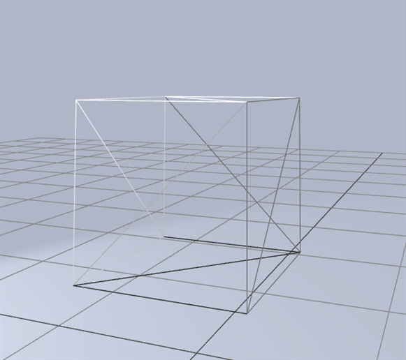

# [ThreeHydroelasticContact](https://zalo.github.io/ThreeHydroelasticContact/)

<p align="left">
  <a href="https://github.com/zalo/ThreeHydroelasticContact/deployments/activity_log?environment=github-pages">
      </a>
  <a href="https://github.com/zalo/ThreeHydroelasticContact/commits/master">
      </a>
  <!--<a href="https://github.com/zalo/ThreeHydroelasticContact/blob/master/LICENSE">
      </a>-->  <!-- No idea what license this should be! -->
</p>

A simple proof of concept for computing Hydroelastic-Style Contacts between SDFs in your browser!




This demo uses `three-mesh-bvh` to treat the meshes like SDFs, but prebaking the meshes to 3D textures would probably be much faster.

Inspired by this video and article about Drake's Hydroelastic Contacts:
- https://www.youtube.com/watch?v=AdCnTyqqQP0
- https://medium.com/toyotaresearch/rethinking-contact-simulation-for-robot-manipulation-434a56b5ec88
- https://arxiv.org/pdf/1904.11433
- https://arxiv.org/pdf/2110.04157

 # Building

This demo can either be run without building (in Chrome/Edge/Opera since raw three.js examples need [Import Maps](https://caniuse.com/import-maps)), or built with:
```
npm install
npm run build
```
After building, make sure to edit the index .html to point from `"./src/main.js"` to `"./build/main.js"`.

 # Dependencies
 - [three.js](https://github.com/mrdoob/three.js/) (3D Rendering Engine)
 - [three-mesh-bvh](https://github.com/gkjohnson/three-mesh-bvh) (Accelerated Raycasting and Closest Point Queries)
 - [Marching Cubes](https://stemkoski.github.io/Three.js/index.html#marching-cubes) (Reference Marching Cubes Implementation)
 - [esbuild](https://github.com/evanw/esbuild/) (Bundler)
 - [worker-with-import-map](https://github.com/kungfooman/worker-with-import-map/) (Hack to allow Import Maps in Workers)
